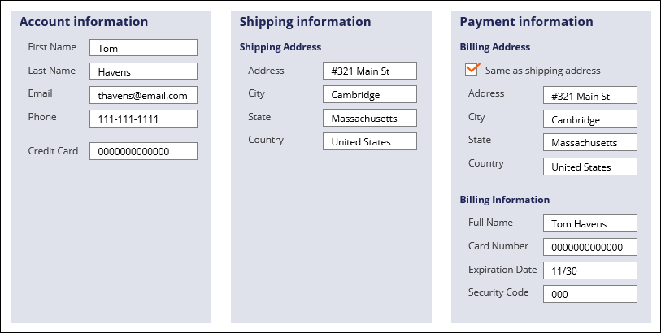
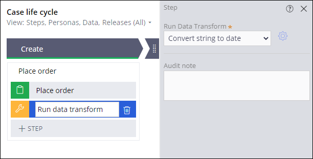
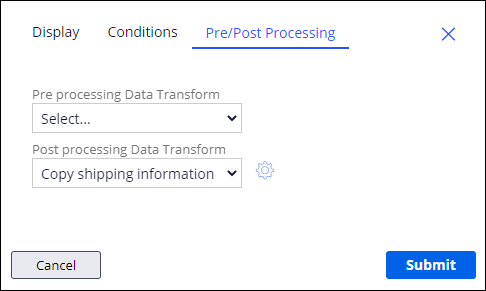
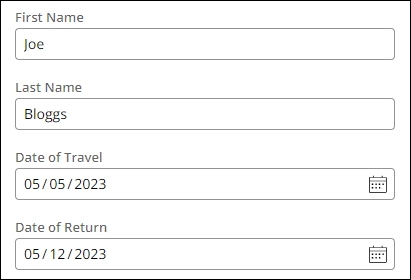
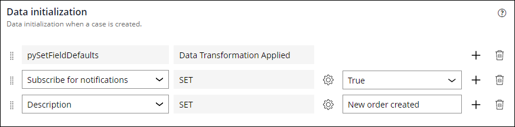

## Data Transforms

**Data Transforms** are used to manipulate data in an application, such as converting data types, moving data between objects, calculating values, etc.

In this example, the billing address was copied from the shipping address information provided by the user using a data transform.

The **Run Data Transform** automation runs a selected data transformation at runtime. 

You can also configure a step to run a data transform before the step runs - known as a **pre-processing action**, or after the step is run, known as a **post-processing action**.

## Default property values

You can set default values for properties that are already known - for example, if you had a booking application, you might already have collected all of this information elsewhere.

On the **data initialization** page in the **case type's** *settings* tab, you can set these default values.

---
## Quiz Notes

