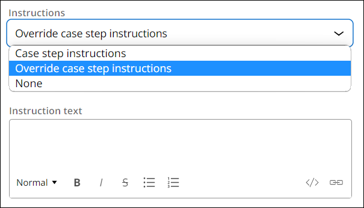
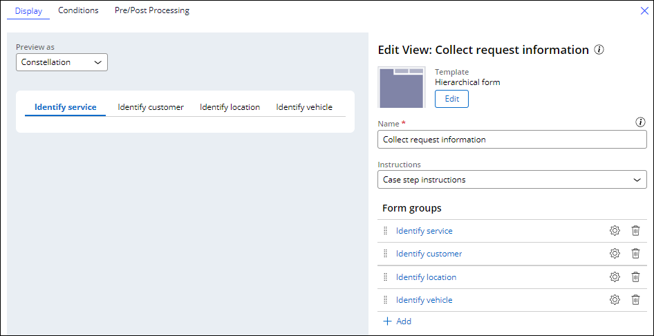

## Form Views

You can use Views to hold collections of **fields**, which can make inputting information more intuitive.

Configure these views from either the **workflow tab of a case type OR the UX tab of a case type/data object**.

*Accessing from the **Workflow Tab***

*Accessing from the **Data Tab***
 - You can create the following view types:
	 - List
	 - Partial
	 - Form

**Form Configuration Options and Layout**
 - There's a number of template options for the views above
 - When configuring a form, you can set the number of columns
 - There's also options to edit the specific margins and use formatted text

**Instructions**
 - By default, a form **View** displays the step instructions from the **case life cycle**
 - You can override them like so:

**Hierarchical Forms**
 - Used to divide complex assignments into small groups of fields
	 - View has tabs to contain relevant forms within
 - **Should be used only when users can fill out the information in any order**
 - `hierarchical forms should not be used in a multi-step form as this implementation may confuse users about the Next button navigation`

---

## Quiz Notes

^ Study

