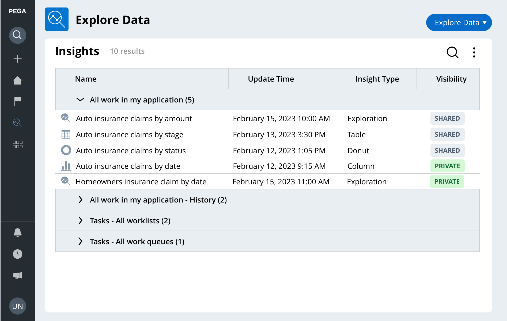
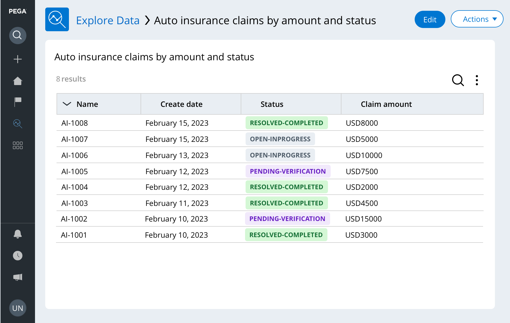
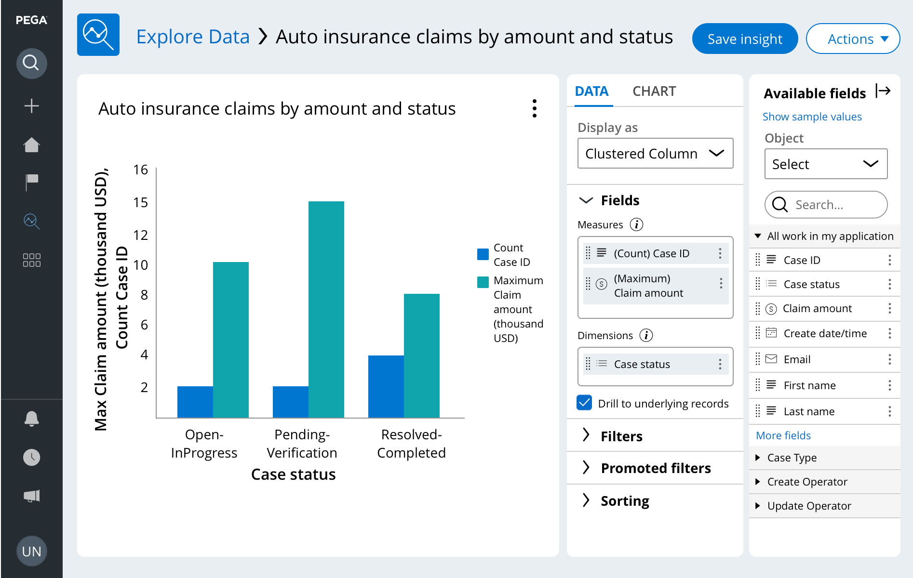

The **Explore Data** page allows you to:
 - Query data
 - Sort/filter/group the results
 - Save queries on the *Data explore landing page* as **Insights**

You can use **Insights** to transform data queries into tables or visualizations (e.g. lists, interactive charts) which can then be shared between users.

### Table-Based Insights

A table-based display for your information:

### Chart-based Insights

Similar to the list-based insight, but more visual, and has tools for adjusting the legend, units, etc.

There's also...

**Simple Value Charts**

---

## Quiz Notes

