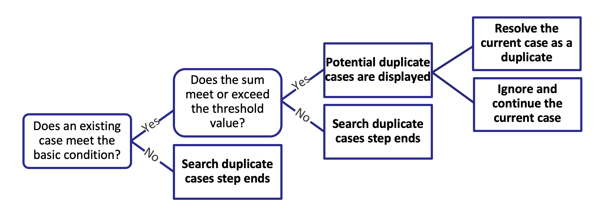

You can use unique identifiers to find instances where cases may be duplicates. For example, you can hypothetically use this to prevent duplicate charges when payment authorization propagates throughout various systems.

This is an example of how Pega uses **basic conditions** and **weighted conditions** to find **duplicate cases**.

---
## Quiz Notes

