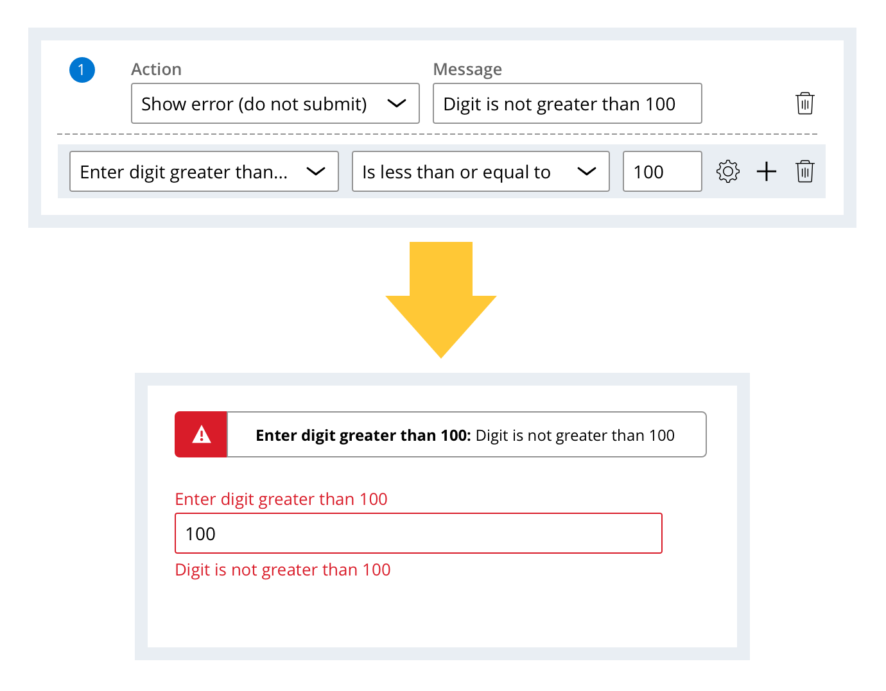
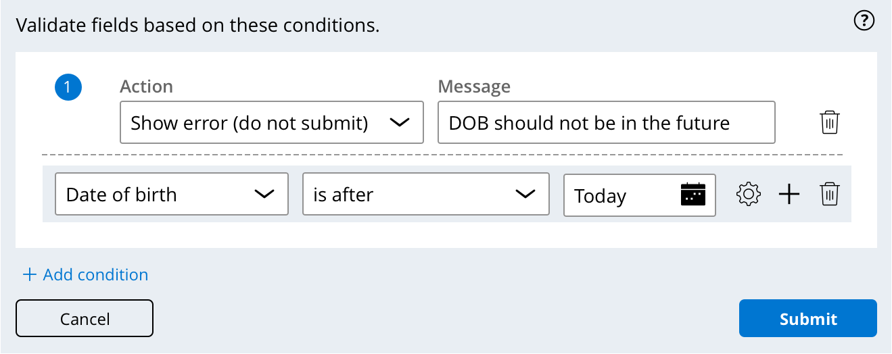

To prevent processing errors, Pega has Data Validation to ensure that data can meet a certain format.

For example, if you wanted to prevent someone from setting their date of birth to a day in the future, you could configure the validation as such:

---
## Quiz Notes

^ Study this