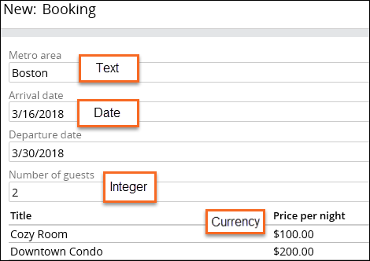
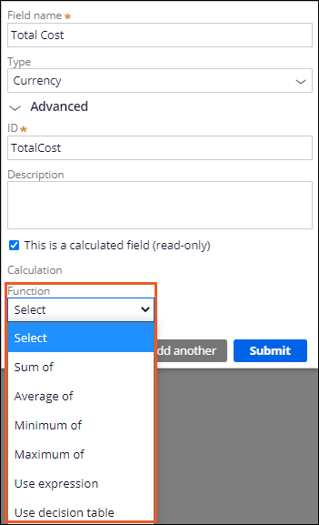
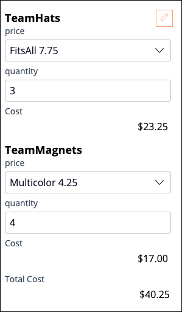
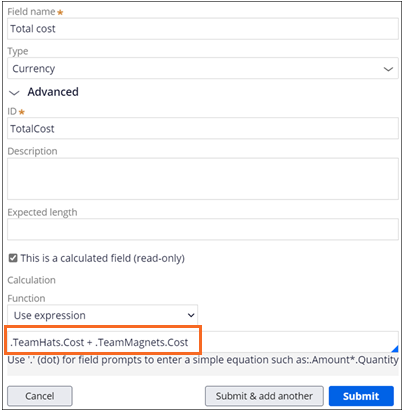
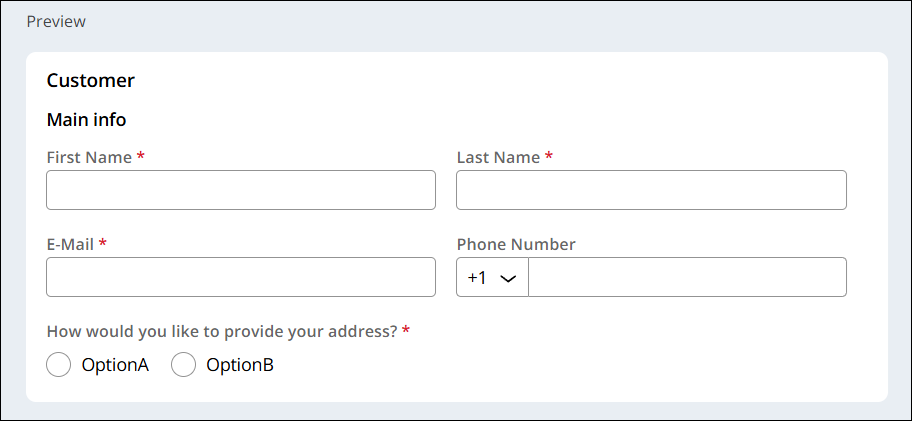

**Fields** can be assigned a **field type**, which defines what format of data you expect.

There's tons of field types - some notable ones:
 - **Picklist** is a list of radio buttons
 - **User reference** is a drop-down that lets you enter or select a user ID in the system
 - **Prediction** is a Pega Process AI tool
 - **Attachment** allows you to upload files
 - **Location** uses a map provider (e.g. Google Maps) for address input or detection

**Primary Fields** are the fields relevant to a **Case Type** - **Label** and **Description** are the default **primary fields**

---

## Calculated Values

You may want to do calculations based off of values entered into fields - e.g., when handling online orders and calculating taxes. 

There's three types of calculations:
- **Functions** iterate over items in a list
- **Expressions** calculate refer to any combination of fields to calculate a field value
- **Decision tables** use a set of conditions to return a response

## Functions

There's some basic functions, e.g. sum, average, maximum and minimum. 
There's also **Expressions**, which allows you to refer to multiple fields:

You use the "dot operator" `.` to refer to a field. You can add text to functions as well:

`"Appraiser " + .AppraiserID + " appraised " + .ItemName + " at a value of " + .AppraisedAmount + "."`

Note that you can't refer to field types such as Email, Phone, and Picklist.

**Decision Tables** need to be configured within **Dev Studio**, and then implemented within **App Studio**.

### Calculation Networks

Pega has a "calculation network" that ensures all fields with a calculation are updated when a value it depends on is updated. 

---

## Views

**Views** are collections of **fields** which can be used to complete an **assignment** with less effort.
They're modular and can be reused.

*An example of a **view**.*

A **field group** is the collection of **fields** inside a **view**, which organize related values together.

### Views vs Forms

*In an example where a customer was shopping online...*
- The customer would enter their address and payment info in a **form**.
- Read-only information about the order, such as price, would be shown in a **view**.

---

### Quiz Notes

 - Using **single input fields** to calculate a sum indicates a custom calculation.