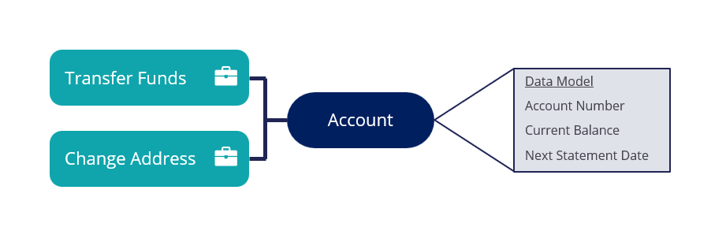
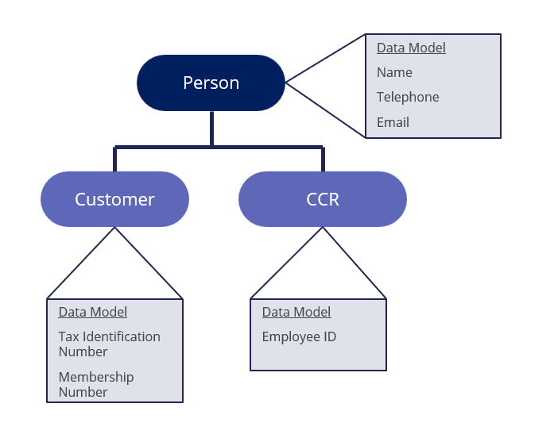
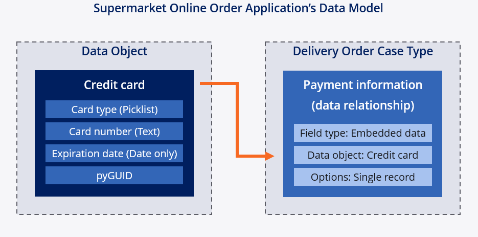
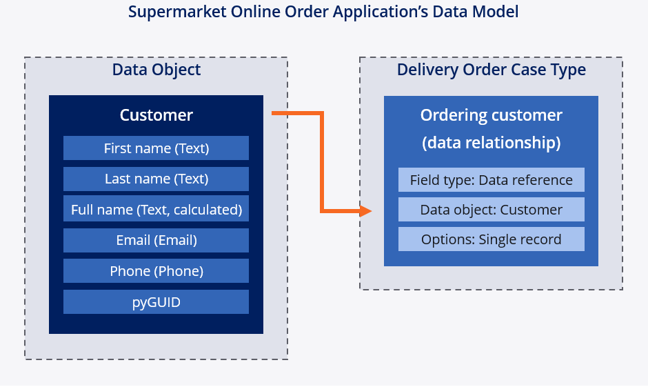
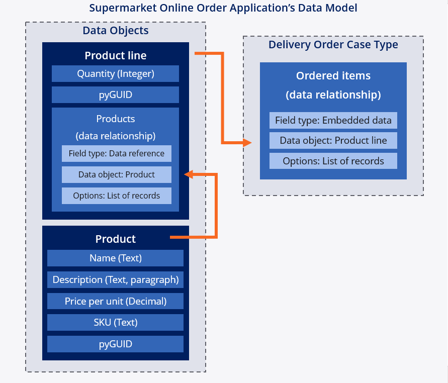

## Data Objects

**Data Objects** - A template for a set of fields that describes an entity (like a person or item)
 - E.g. a Person data object might have name, address, business, etc.



In this example, the *Account* **data object** has two **case types** for transferring funds and changing address, while its **fields** describe the account - including *account number, current balance, and the next statement date*.

### Structure

**Data Objects** can group **Views** and other rules related to a data object.

If you had a *Candidate* data object, it could include fields for first and last names, and a calculation to combine the names into a full name.

### Inheritance

**Data Objects** can reuse assets from existing data objects through **inheritance**. For example, you could have a *Person* **data object** with fields for a name and address, and then have *Customer* and *Worker* **data objects** with their own fields and the fields of a *Person*.



### Sourcing

**Data objects** can be **sourced** from Pega itself, or from your own records, e.g. an external database.

### Best Practices

 - Use the Pega default data objects whenever possible, e.g. email or location
 - If the Pega data objects are missing something, extend them to add additional fields
 - If none of them are a good fit for your data, create a custom data object

---
## Data Relationships

A **data relationship** is a container that is associated to a set of **fields**. Unlike **data objects**, the **data relationship** doesn't store data - it is used to relate data between **data objects** and **case types**.

### Data Relationships and Field Types

**Field types** associated with **data relationships**:
 - **Embedded data:** Used when info is collected from the user into a **case**
	 - E.g. getting contact info, storing it in a patient record
 - **Data reference:** Used when reusing an external **data object** for a **case**
	 - E.g. for referring to a facility where an appointment is made
 - **Case reference:** Use when reusing data from another **case**
	 - E.g. to find the list of cases from a 
 - **Query:** Use when you need read-only access to info external to a **case**
	 - e.g. for returning available appointment dates

### Single or List of Record(s) Data Relationships

There's two types of **data relationships:** **single record** or **list of records**
 - **Single Record** is used for a situation where only a single set of fields are used to resolve a case
	 - E.g. a Customer record that takes in identifying information for a single person
 - **List of Records** is used for situations where a list of data objects is needed to resolve a case
	 - E.g. a list of customer records, displaying multiple people, each with their own info


## Detailed Use Cases

### Embedded Data data relationship

An **Embedded Data Field Type** is used when data is sourced from a user from directly inside a **case**
instance.

Imagine you entered your credit card info into an online form for an order you were about to place. While the information for that credit card would be stored in the **case** information associated with the order, a **Delivery Order Case Type** could be made to refer to the credit card information from the **case** directly.



### Data Reference data relationship

A **Data Reference Data** relationship is used when the data needed for a **case** is sourced from outside of the case, whether in Pega or an external system. Similarly, the customer data object contains all of the fields in the delivery system outlined below.



### Data Relationships between Data Objects

**Data relationships** make it possible to reference a **data object** inside another **data object.**



In this example, the *Product* data object is sourced from an external system of record, stored as a **list of records**. Using the product line to store the quantity of the item, all of the item's information can be referenced.

### Example

```
As part of a Case Type that manages appointments at a veterinary clinic, clients can review past appointments by selecting from a list of appointment Cases. 

What field type do you configure for this behavior?
```
`Case reference - it can refer to multiple records from a selected case type.`


### Quiz Notes

```
The Query field type defines a field to access data stored in a Data Page. The Embedded Data Field Type defines a field to access data users supply in the Case.
```