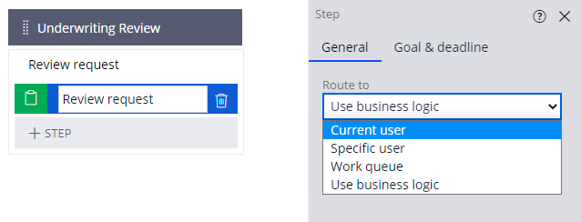

## Routing Work

To prevent duplicate work between multiple stakeholders, you can use **assignment routing** to improve efficiency - *you manually route work to the most appropriate users.*

You can route **Assignments** to the current user, a specific user, a Work Queue, or use business logic.

 - Route to the **current user** if the user who completed the preceding assignment is the one who needs to complete the current task.
 - Route to a **specific user** if an individual is supposed to complete the assignment. A **worklist** is a list of all open **assignments**, in order of importance, for a **specific user**.
 - A **work group** is a cross-functional team that uses a **work queue** to distribute work. It too has a list of open **assignments** in order of importance, called a **work queue**. Work is either chosen by members of the **work group**, or is assigned to a specific user by a manager.
 - If you want to route work based on certain conditions, use **business logic**. For example, when insuring RVs, additional review is needed - you might conditionally assign work for cases where a new RV insurance customer gets work from both the regular review staff, and RV underwriters.