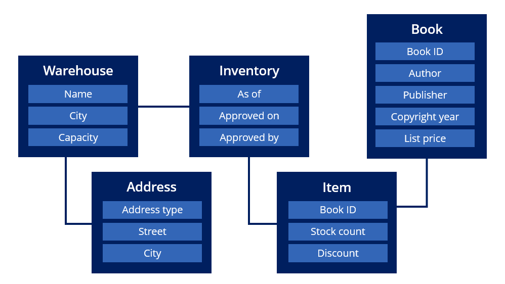
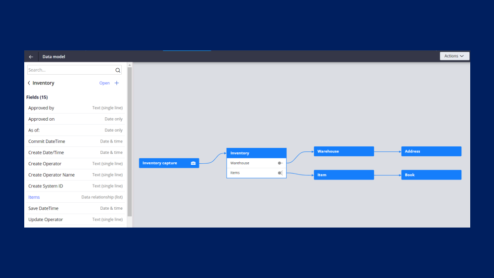
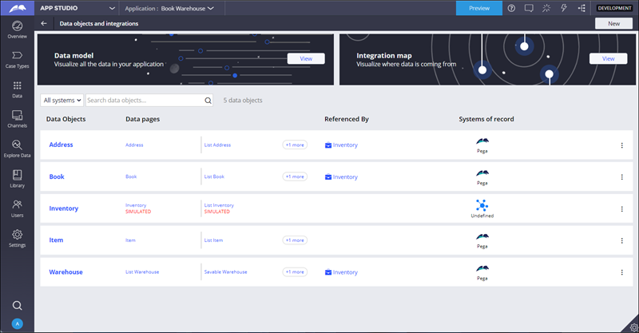
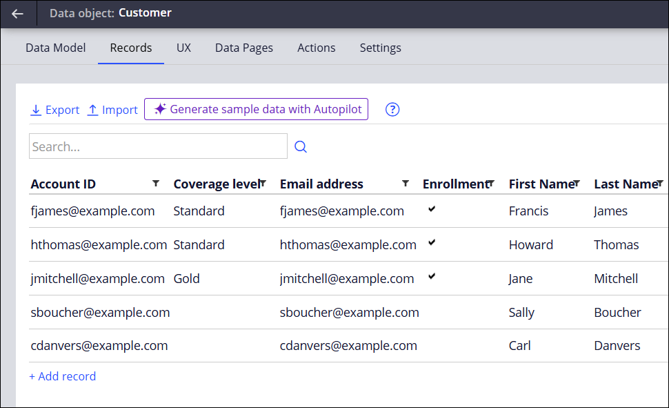
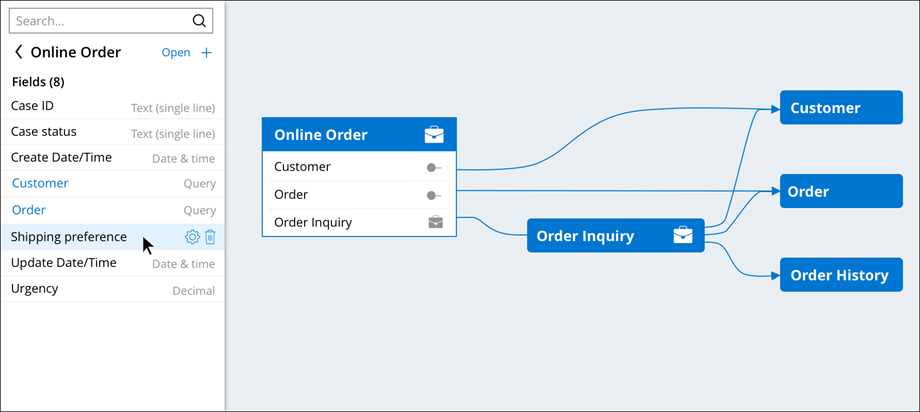

**Data Model** - A visual representation of an organization's data and how they're connected
 - The purpose of a **Data Model** is to define what data your application requires

*Pega has 3 variations of the **Data Model**:*
 - The **Conceptual Data Model**
 - The **Logical Data Model**
 - The **Physical Data Model**

### The Conceptual Data Model


 - Focuses on **Data Entities** (e.g. Addresses, Items) their **Attributes** (e.g. Street, SKU), and how they're **Linked**
 - Created by **Business Architect** and stakeholders - acts as a good starting point, and can prevent redundantly collecting data

### The Logical Data Model


The **Logical Data Model** is the **Conceptual Data Model** translated into Pega, using **Data Objects** and **Fields**.
 - **Fields** are reusable UI components that have a name and *field type*, which determines the data's format, e.g. Money or Date
 - **Data Objects** are a structure for describing an entity by grouping related **fields**

### The Physical Data Model


Reflects data as it is stored in the Pega application.
 - Can be found in the **Integration Designer**

```
The Logical Data Model focuses on the creation of the data objects and fields that define the information needed to successfully resolve a case.  

The Physical Data Model reflects data as it is stored and accessed in an organization's external systems of record.  

The Conceptual Data Model is a living document that details the data entities, attributes, relationships associated with an organization's data.
```

---

## Data Records

**Data Objects** - Helps you organize and collect fields, Data Pages, views, etc.
**Data Records** - The collection of fields and values that make an instance of a data object
 - `Data Records provide access to data that is used to process cases but is not part of an application.`


*Example Customer Data Records*

## Data Pages and the Visual Data Model

**Data Pages** - Shows how the application uses data and their association
**Visual Data Model** - A diagram of the associations formed from the Data Model

*The **Visual Data Model***

## Integration Designer

**Integration Designer** - A place to view all data objects/pages and their dependencies, including external systems, as well as how they're connected.

**Integration Map** - A diagram of the data objects, **Cases**, and where in the application they're sourced

---

### Quiz Notes


Note that you **can't edit the system fields from the Visual Data Model.**
